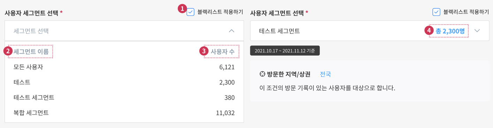

# 캠페인 목록

### 캠페인 목록

.png>)

1. **생성하기**: 새로운 캠페인을 생성할 수 있다.
2. **선택한 캠페인 삭제**: 7번 리스트상에 체크된 캠페인을 삭제할 수 있다.
3. **전체 목록 다운로드**: 캠페인 전체 목록을 CSV로 다운받을 수 있다.
4. **리스트 목록 갯수 설정**: 기본 15개 30, 50, 100, 200 설정이 가능하며, 설정 옆 총개는 캠패인 총개를 의미한다.
5.  **캠페인 필터**: 이달생성, 이달종료 캠페인 갯수를 확인할 수 있다.

    진행, 대기, 테스트, 종료는 버튼으로 활성화/비활성화 하여 캠페인 리스트 필터가 가능하다.
6.  **활성 지오펜스**:

    활성 지오펜스란 진행중인 캠페인에 설정한 지오펜스를 뜻하며, 총 2000개 까지 활성화할 수 있습니다.\
    이미 진행중인 캠페인에서 설정한 지오펜스를 새로 진행하는 캠페인에서도 사용하는 경우, 활성 지오펜스 수는 증가하지않습니다. 이전 캠페인에 설정된 지오펜스(=활성 지오펜스)가 새로 생성된 캠페인에 설정이 동일하다면 누적 집계하여 계산 하지 않습니다.

    ex)\
    A캠페인 → ㄱ 지오펜스 그룹(circle 10, polygon 12) = 활성 지오펜스 22개\
    B캠페인 → ㄱ 지오펜스 그룹(circle 10, polygon 12) = 활성 지오펜스 22개\
    C캠페인 → ㄴ 지오펜스 + ㄱ 지오펜스 그룹 = 활성 지오펜스 23개

    

    반대로 활성 지오펜스를 비활성화 하려면 캠페인 A,B를 대기시켜야 지오펜스 그룹이 비활성화 됩니다.\
    활성 지오펜스는 캠페인 리스트 우측 상단 상시 상태를 확인할 수 있으니 캠페인 운영시 참고 바랍니다.
7. **캠페인 리스트 페이지**: 이전 캠페인 리스틀 확인할 수 있다.

### 목록

.png>)

1. **체크박스**: 캠페인을 선택/해제 가능하다.
2. **ID**: 캠페인 고유 번호
3. **고객사ID**: 고객사가 지정한 ID
4. **캠페인명**
5. **캠페인 상태**: 진행, 대기, 테스트, 종료 총 4개의 상태 <mark style="color:orange;">**(모바일 웹 상태 변경 지원)**</mark>
   * 진행 중 : 캠페인이 실제로 동작합니다.
   * 테스트 중 : 캠페인을 진행하기 전 테스트할 수 있으며 메시지는 무제한 발송됩니다.
   * 대기 중 : 캠페인 생성 시 Default 상태입니다. 진행 중인 캠페인을 멈출 때 사용할 수 있습니다.
   * 종료 : 대기 중/테스트 중/진행 중인 경우 제공되지 않으며, 캠페인이 종료되면 자동으로 ‘종료’ 표시로 변경됩니다.
6. **도달**: 푸시메시지 도달 건수
7. **응답**: 푸시메시지 응답 건수와 응답률
8. **시작일**: 캠페인 시작일
9. **종료일**: 캠페인 종료일
10. **생성자**: 캠페인 생성자
11. **생성일**: 캠페인 생성일
12. **방문 성과:** 캠페인 방문 성과 페이지로 이
13. **메시지 성과**: 캠페인 푸시메시지 발송 성과
14. **수정:** 캠페인 조건 수정
15. **복사**: 캠페인 조건 복사
16. **히스토리**: 캠페인 푸시메시지 성과 다운로드 히스토리
17. **캠페인명**: 캠페인 요약페이지로 이동

### 캠페인 요약

.png>)

캠페인 리스트에서 캠페인명을 클릭시 캠페인 요약 페이지로 이동합니다.

.png>)

#### 캠페인 요약

1. 캠페인 복사, 수정, 삭제, 목록으로 를 이용할 수 있습니다.
2. 캠페인의 상태를 변경할 수 있습니다.(단 종료된 캠페인은 상태를 변경할 수 없습니다.)

### 캠페인 메시지 성과

.png>)

1. **'성과' 버튼**
2. **캠페인 제목명**
3. **사용자 세그먼트 수**: 캠페인에 설정된 세그먼트 수 입니다.
4. [**해당 캠페인 방문 성과 보기 바로 이동**](../report.md)
5.  **메시지 도달/응답**

    1\) 메시지 도달/응답 선택 가능

    2\) 10분 단위로 집계됨

    3\) 메시지 도달 건수 노출(캠페인 매칭 수)

    \- 일자 별 도달 건수 선그래프 노출됨

    \- 마우스 오버시 날짜, 도달건수 노출됨

    \- csv, jpg 형식으로 다운로드 가능

    4\) 도달한 사용자 수 노출(캠페인 매칭 고유 사용자수)

    \- 일자 별 도달 사용자 수 막대 그래프 노출됨

    \- 마우스 오버시 날짜, 사용자 수 노출됨

    \- csv, jpg 형식으로 다운로드 가능

    5\) 메시지 응답 건수 노출

    \- 일자 별 응답 건수 선그래프 노출됨

    \- 마우스 오버시 날짜, 도달건수 노출됨

    \- csv, jpg 형식으로 다운로드 가능

    6\) 응답한 사용자 수 노출(캠페인 매칭 고유 사용자수)

    \- 일자 별 응답 사용자 수 막대 그래프 노출됨

    \- 마우스 오버시 날짜, 사용자 수 노출됨

    \- csv, jpg 형식으로 다운로드 가능
6. **메시지 성과 확인**

<figure><figcaption>
일반 메시지
</figcaption></figure>

<figure><figcaption>
A/B 테스트 메시지
</figcaption></figure>

메시지 성과는 일반 메시지와 A/B 메시지 성과 모두 확인이 가능합니다.

1\. 캠페인 기간 동안 총 메세지 도달 건수와 일별 메시지 도달 건수를 확인할 수 있습니다

2\. 캠페인 기간 동안 총 메세지 도달 사용자 수와 일별 메시지 도달 사용자 수를 확인할 수 있으며,\
중복 사용자 수는 포함하지 않습니다.

3\. 캠페인 기간 동안 도달한 메세지에 한하여, 총 메세지 응답 건수와 일별 메시지 응답 건수를 확인할 수 있습니다.

4\. 캠페인 기간 동안 도달한 메세지에 한하여, 총 메세지 응답한 사용자 수와 일별 메시지 응답 사용자 수를 확인할 수\
있습니다. 중복 사용자 수는 허용하지 않습니다.\
5\. 다음 그래프의 JPG, CSV 파일 다운로드 받을 수 있다.
